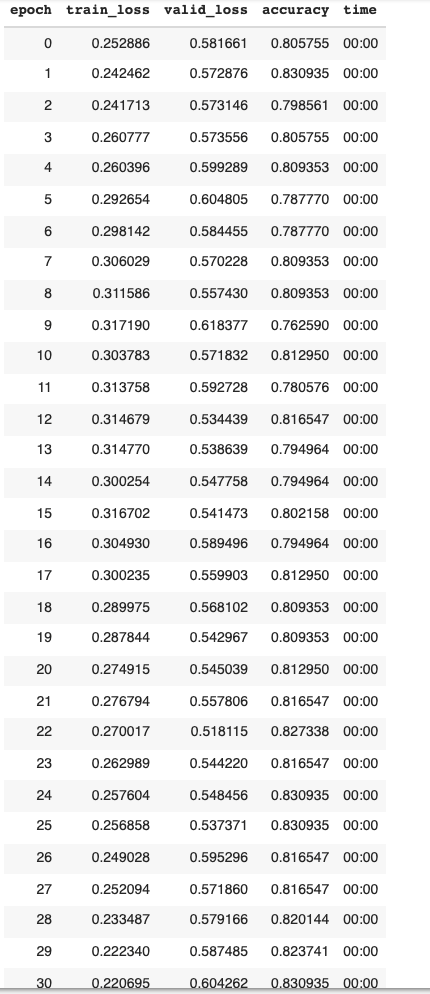
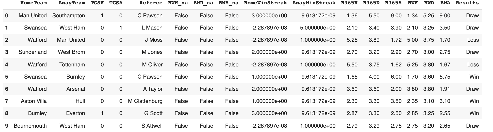
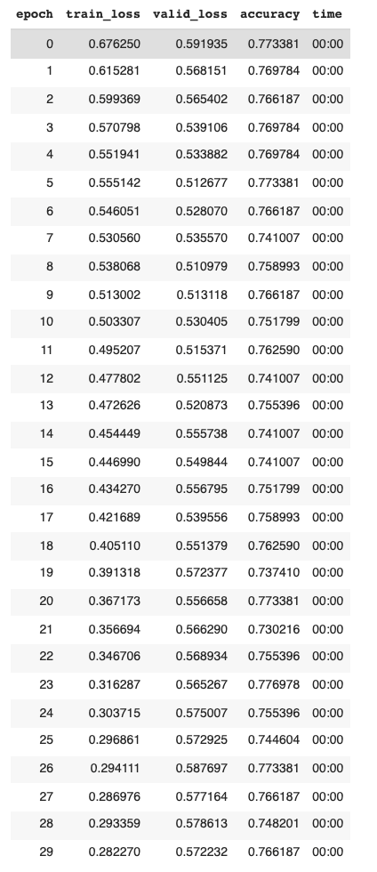
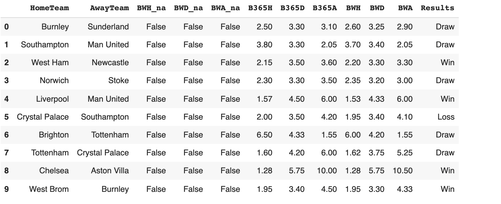
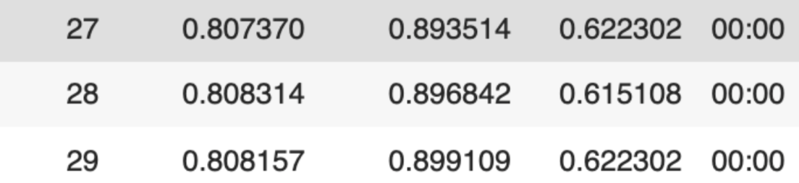
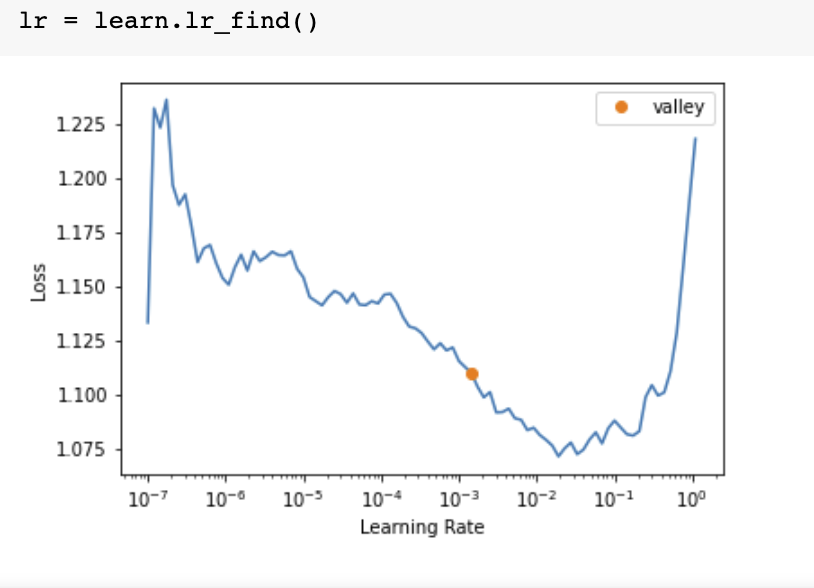

# FIFAI

### By Eshaan Lumba, Kenneth Ochieng, Jett Bronstein and Aidan Garton

<!-- ## Table of Contents

1. [Inroduction](#introduction)
2. [Related Works](#related-works)
3. [Methods](#third-example)
4. [Discussion](#fourth-examplehttpwwwfourthexamplecom)
5. [Reflection & Future Works](#outro) -->

## Abstract  
Attempts to accurately predict the outcomes of premier league soccer matches have historically drawn interest from various soccer stakeholders such as sponsors, avid fans, gamblers, and investors. Match predictions are often made using possible odds for or against teams. The most popular odds today are created mainly from statistical methods i.e the poisson distribution, pooled bookie opinions, and other probabilistic methods. Only a few recent ones have been created using neural network models. In this paper, we trained a neural network model using available premier league data from the 2014/2015 season to the 2021/2022 season, and achieved 80% accuracy in predicting a win, loss or draw for future matches. We implemented the model using fastai and made use of a team’s key data points including cumulative win streaks, home goals/away goals, whether they played home/away, match referee e.t.c. We recognize, however, that our model can unintentionally propagate negative social impact by encouraging compulsive gambling or diminishing the thrill of watching premier league matches with 70% - 80% accurate pre-match predictions. 

Keywords: fastai, win streak

## Introduction 

The English Premier League is considered one of the most exciting soccer leagues in all of the world making Premier League games some of the most watched cable events in the world. Like other mainstream sporting leagues, the Premier League attracts significant attention from the gambling industry. Currently, predicting the victor of a Premier League match with high certainty is very difficult. We will attempt to construct a comprehensive neural network to successfully predict the result of Premier League matches on a consistent basis.

To improve upon the previous results, we will try to use a more robust dataset with more pre-game and post-game datapoints such as expected goals for and against along with a more optimized algorithm. Another key modification is that their results are outdated (up to 2018), whereas we want to keep our model as up to date as possible. This would mean taking having a dataset with that includes the latest games from the ongoing 2021-2022 season. 

Ideally, we would like to have an algorithm that can accurately predict the result upwards of 70% of the time. Though this is about 10% lower than the current best, we feel as though it would be an appropriate challenge for us to be close to that level of accuracy given that our model is not too complicated, and we will not be including too large a set of datapoints. A key challenge is understanding exactly what datapoints matter the most and what matter the least. This is difficult to predict beforehand and trial and error with different sets of datapoints might lead us to improved algorithms.

We acknowledge that predicting the result of a Premier League match is a very difficult problem, but we hope to succeed and improve on previous results. Ultimately, we would like to test our data on the current set of ongoing premier league matches to determine the success rate of our algorithm. A lot of factors can change as the form of teams changes throughout the season, but we are confident that we can build a strong model.

## Related Works 

Due to the high demand and market for sports betting and the surrounding fan anticipation/engagement, there have been several previous studies on the prediction of sporting events using neural networks. While much of the work produced to predict soccer outcomes has been adapted from the prediction of other sporting events, such as those of NBA and NFL games, the following papers have provided essential and extensive background knowledge on our topic for soccer matches, some of which focus entirely on the English Premier League, just as we do in our study. Here, we outline the main contributions of these works and explain the nuances and points of expansion that our study focuses on.

The primary source and motivation for our project comes from a study done by Sarika et al. titled [“Soccer Result Prediction Using Deep Learning and Neural Networks”](https://link.springer.com/chapter/10.1007/978-981-15-9509-7_57). This study compares several different prior sport outcome predictors and constructs their own in the form of an RNN (recurrent neural network). Using data from the 2011-2017 seasons of the EPL, Sarika and his colleagues trained their model to accurately predict EPL match outcomes up to 80% of the time. Sarika and his team used LSTM (long, short-term memory) cells composed of three gates: forget gates, input gates, and output gates. We use this architecture as our main source of motivation to produce an even higher accuracy model for EPL game outcomes.

Another key piece of research for our project comes from Wagenaar et al. in their paper [“Using Deep Convolutional Neural Networks to Predict Goal-scoring Opportunities in Soccer”](https://www.ai.rug.nl/~mrolarik/Publications/ICPRAM_2017_67.pdf). This paper uses two-dimensional image data to predict the chance of a goal-scoring opportunity based on the location of the ball and players relative to each other and each team’s goal. By using a CNN architecture, Wagenaar and his team were able to accurately predict the chance of a goal being scored given a snapshot of the field 67.1% of the time. Notably, this paper uses training data from the Bundesliga, but it still provides pertinent and helpful information on how snapshots of game positions might aid the prediction of overall soccer match score-lines and outcomes as we aim to improve upon with our study.

Predicting soccer games using neural nets is still a relatively niche field and remains mostly under researched. We found one example of a statistical method done by Benedikt Droste in his article, ["Predict soccer matches with 50% accuracy"](https://towardsdatascience.com/predict-soccer-matches-with-50-accuracy-a24cc8078877), using the Poisson distribution and the Poisson Regression in python. He first created a Poisson distribution to fit farely well with most of the match results in the 2018 -2019 premier league season and proceeded to predict the results of the last 10 matches of the same season using the Poisson Regression. The predictions achieved a near 50% accuracy. To enhance the predictions, the regression took into account key data points for each team such as the likelihood that they would score, the likelihood that they would concede and the likelihood that they would score if they were a home or away team. Moreover, the author suggests looking into more data points such as team form, more matches and correctness of under/over underestimating results to make it better. Similarly, with an attention to key match factors, we found a 2018 research paper titled ["Football Match Statistics Prediction using Artificial Neural Networks"](<https://www.iaras.org/iaras/filedownloads/ijmcm/2018/001-0001(2018).pdf>), by Sujatha et al, where they argue that for any two teams in contention, correctly predicting the outcome of a match involves paying attention to key factors including current team league rank, league points, the UEFA coefficient, home and away goals scored/conceded, team cost, home wins/loses, away wins/loses, home advantage e.t.c. In their research, they pit two Bundesliga teams (Bayern Munich and Dortmund) against each other, and trained a neural net with inputs for each team based on the key factors. They were able to predict outcomes of multiple matches between the two teams with relatively high accuracy (percentages not provided) and in some cases did better when compared to bookie odds.

From our research, we note that neural nets generally do better than available statistical methods in predicting match outcomes. Given the availability of a large volume of premier league data, we plan on coming up with a proper classification of key data points and training a neural net that can predict a winning team through percentage chance or number of expected goals.

## Methods

For our model, we decided to use a fully-connected Neural Network using [FastAI](https://docs.fast.ai/). We deviated from our original plan of using an RNN with LSTM. [Past researchers](https://link.springer.com/chapter/10.1007/978-981-15-9509-7_57) have already built an RNN with LSTMs and they had a few more datapoints than we had. Though we initially planned to use a combination of [Pytorch](https://pytorch.org/) and FastAI, we felt that, given our tabular data, it would be best to benefit from the best practices already implemented in the fully connected learning models built by FastAI on top of PyTorch.

We had also discussed building the model in a different way. For this, we would have 20 or so different models (1 for each Premier League team). When predicting the result of a match between two teams, we would get predictions from the home and away team's model, and then compare the predictions to output one final result prediction. However, as we gathered the data and started building the project, we felt that this was unnecessary, as it would be equivalent to simply building one model that took in all of the data, instead of having the 20 or so separate models for each team. It would also allow us to spend less time training the models. 

For our model, we gathered English Premier League [data](https://www.football-data.co.uk/englandm.php) from the last 8 seasons (including the data from the first half of this season). However, we did not use all the datapoints from the dataset. We used the datapoints for a specific game that one could know beforehand. We did this because this would allow us to predict the model. Hence, we did not consider match statistics such as shots, or yellow cards in our model. If we wanted to predict a game between two random teams, we would not have these datapoints available to us before the match, so we did not feel that they would be useful to train the model on for our immediate purposes. Instead, from the dataset, we gathered the following columns of data:

- HomeTeam (The team that was playing at home)
- AwayTeam (The team that was playing away)
- Referee (The referee for the game)
- Results (Our dependent variable, whether the Home Team won, draw or lost)
- B365H (Betting odds from Bet365 for the home team win)
- B365D (Betting odds from Bet365 for a draw)
- B365L (Betting odds from Bet365 for the home team loss)
- BWH (Betting odds from Bet&Win for the home team win)
- BWD (Betting odds from Bet&Win for a draw)
- BWL (Betting odds from Bet&Win for the home team loss)

Note that the last 6 datapoints from above are essentially betting odds for the result of a game from two different betting companies chosen randomly from the dataset. In addition to the variables taken from the dataset, we also made some of our own calculations and added to the dataset. We added the following datapoints to the dataset:

- HomeWinStreak (The current winning streak of the home team)
- AwayWinStreak (The current winning streak of the away team)
- TGSH (Whether the home team was on a winning streak or not)
- TGSA (Whether the away team was on a winning sreak or not)

Ultimately, these datapoints proved to be the most valuable in determining the result of a game. The motivation behind our creation of these datapoints was from [past researchers](https://link.springer.com/chapter/10.1007/978-981-15-9509-7_57) who had achieved 80% accuracy with RNNs and LSTMs. They felt that knowing the winning streak of a team and with that, a pattern of their results would help improve the accuracy. Furthermore, it allowed us to somewhat make use of the home and away team's "history" of results leading up to the game, to an extent mimicking the effect of RNNs. Though we did not use an RNN, we constructed these datapoints to work in a similar way to how RNN's consider the history of data. 

For our validation set, we used the last 10% of matches from our whole dataset. Since our ultimate goal was to predict this season's matches, we felt that it would be appropriate to build the validation set in this way.

Thus, our various different sets of datapoints allowed us to build multiple different models and perform different sets of analysis.

<!-- ## Methods Draft 1

We want to use a recurrent neural network along with long short-term memory since we want to keep track of patterns and form. Our inputs will be a vector of integer values tracking the goals scored by the home and away team, whether the team is at home or away and whether the team is on a winning streak. We will be performing classification. For both the home and away team we want to predict the result for, the algorithm will predict the difference in goals scored by both teams. Hence, we will have two difference of score measures. We will then subtract these scores from one another to determine the final result. A positive final value is a win for the home team, a negative final value is a win for the away team, and a value of 0 implies a draw. Our algorithm will predict the most probable result from the possible options of a draw, a win for the home team and a win for the away team. Hence, our output will be a column vector of floating point values that contains the difference in scores.

For our project we will mainly utilize Python and, in particular, two powerful neural network libraries--[PyTorch](https://pytorch.org/) and [FastAI](https://docs.fast.ai/). We will use FastAI to create preliminary models of each team in the EPL that we hope to create predictions for. Trained on 5 seasons of data (2015-2020), these models will predict a given outcome against another team based on the home and away goals and win streaks of each team. Once each model has output a goal prediction against the other team, we will take the difference to predict the winning team. Once we have initial models, we will transition to PyTorch to flesh out our models and experiment with different model types. Following in the footsteps of the [Sarika et al.](https://link.springer.com/chapter/10.1007/978-981-15-9509-7_57) paper, we will experiment with a recurrent neural network architecture to allow us to track and model temporal dynamic behavior.

For our dataset we will use [Football-data](https://www.football-data.co.uk/englandm.php). By scraping the online dataset with the Python data scraping library Pandas, we will gather home and away goal results for each game in our target training seasons as well as manually calculate win streaks to train our individual team models. After our initial training and results evaluation we will consider other parameters to train our models on. By using random trees we will determine the most applicable and correlated parameters to a teams goal output and expand our models to incorporate these parameters accordingly. Since we are working with such a small dataset we will potentially need to include a high drop out rate in order to prevent our models from simply memorizing game outcomes and instead forcing the models to learn correlations from the inputs. -->

<!-- ## Project Update 1 -->

<!-- #### Software
We will use a combination of [PyTorch](https://pytorch.org/) and [FastAI](https://docs.fast.ai/).

#### Our Dataset
We will use a combination of ["English Premier League stats 2019-2020"](https://www.kaggle.com/idoyo92/epl-stats-20192020?select=epl2020.csv), ["2021-2022 Premier League Stats"](https://fbref.com/en/comps/9/Premier-League-Stats) and ["English Premier League (football)"](https://datahub.io/sports-data/english-premier-league#readme).

#### Overview of project
We want to use a recurrent neural network along with long short-term memory since we want to keep track of patterns and form. Our inputs will be a vector of floating point values (expected goals for and expected goals against for the home team for the particular game). We will be performing classification. Our algorithm will predict the most probable scoreline out of a multitude of options. Hence, our output will be a vector of floating point values that hold the probablility of the match ending in a given scoreline.  -->

<!-- ## Project Update 2

What we have completed or tried to complete:

- We have conclusively decided our final project goal which is to predict the result of an English Premier League (EPL) soccer match.
  - This was changed from predicting the scoreline of an EPL soccer match.
- We have decided to use the dataset from [Football-data](https://www.football-data.co.uk/englandm.php).
  - This dataset is the original, up-to-date dataset that some of the other datasets sourced their information from.
  - The dataset also contains a lot of irrelevant information that we will have to remove.
- Completed our introduction and related works sections.

Issues we have encountered:

- Finding a comprehensive and up-to-date dataset containing relevant data from at least the last 4 seasons.
- Understanding exactly what data we need for our project.
  - We feel as though it might require trial and error and we might have to test the neural network with different datasets.

Addressing Hypothesis comments:

1. We have changed our project goal from predicting the soccer scoreline to predicting the result of the game. For this, we want to use an RNN since that has had the most success in the past. We also thought it made sense because it allows the network to remember previous results and hence take into consideration the form of the team.
2. We are currently doing that and are taking a look at how to do it in PyTorch.
3. We have formatted the links and updated the document for our introduction draft.
4. We have added links in a consistent format for our introduction and related works draft.
5. We briefly discussed the ethical implications of building a successful project in our last paragraph in our initial introduction outline. However, we have now added a more comprehensive discussion on it at the end our current introduction draft. -->

<!-- ## Discussion Outline -->

## Discussion and Results

### Primary Model

Our primary model was trained on input data given by several basic data points of previous EPL matches. These included the names of the home and away team and their current win or loss streaks. An extra column was included to denote if either team was on at least a three game win streak or not. The results of the match (win, loss, or draw) were used as validation data, thus training our model to predict such outcomes of a given match. After training on eight seasons of matches (the 2014-2022 EPL seasons) throughout 30 epochs (with a batch size of 80), our model was able to produce an accurate prediction of a given match result up to 75% of the time.

Training again using 60 epochs increased the accuracy up to 79% of the time. By increasing the batch size from 80 to 124, several more points of accuracy were obtained consistently, resulting in a final accuracy of up to 80.21%.

<!-- 

  

 -->

No further adjustments in batch size or number of epochs resulted in an increase in the prediction accuracy. These results match up closely with those of the study done by Jain et al. This is fairly unsurprising given that the training data and provided inputs were the same for both models. Similar to the Jain et al. study, we found that a batch size of around 30 to maximize our model’s prediction accuracy. From here we attempted to increase accuracy by adjusting the input parameters to include the name of the referee to account for potential bias and/or correlation between the arbiter of a given match and its outcome. Including this extra parameter ended up having little effect on the model as the average prediction accuracy leveled around 80%. This suggests that there is little to no correlation between the result of a match and the arbiter who oversaw it--an unsurprising and reassuring outcome. Given our success in producing a network that reached accuracies of previous studies, we moved forward by considering as inputs the predictions of several betting companies in order to provide insight into their effects on (and/or correlation with) premier league match outcomes.

### Including Odds Data

By including the predictions made by different betting organizations, our model reflects the general expectation of a matches outcome by bettors. Adding predictions made by bookie odds (namely Bet365 and BetWay), the accuracy ranged between 73% - 77% and averaged around 75%. Note that the column B635H corresponds to the general consensus that the home team would win, as gathered by B365, while B365A corresponds to such odds for the away team. This is similarly the case with the BWH and BWA columns with regards to the esxpectations of bettors gathered by BetWay. Below is a sample batch using this data as well as the highest produced accuracy from the model.

Given the high variance in expectations made by betting organizations as well as the immense uncertainty in match outcomes, these added parameters unsurprisingly did not yield significantly different results from our initial model. Human psychology plays a large factor in the odds expressed for a given matches outcome and thus make our model more prone to humman error and bias. To complete our analysis we trained a model solely using the betting odds as inputs.

### Just Using Odds Data

For the model only utilizing the predicted odds by the aforementioned betting organizations, the accuracy dropped to between 50% - 61%. This reflects that by combining the predictions from these top two betting agencies, a model is only able to accurately predict a match outcome slightly better than half of the time. By training a model on only the predictions of other programs, the prediction power of our model was significantly reduced. This speaks to the lack of substance to such a model--one that does not rely on information about past matches themselves. Below is an example training batch as well as the final accuracy of this model.

  

Similarly, training a model only using BetWay odds and another only using Bet365 data yielded accuracies between 50-60%. Perhaps by increasing the number of betting agencies would yield different results, although this demonstrates the lack of accuracy by standard betting organizations.

### Varying Hyperparameters

To maximize the model's accuracy we trained it several times, varying the hyper parameters. Primarily the parameters that we altered were the batch size and number of epochs. We also obtained the optimal learning rate using fastai's `lr_find()` method as seen below.

<!--  -->

  

This on average game a learning rate of around 0.00144, although it varied slightly depending on the batch size used.

Below are the accuracy results of changing the number of epochs and batch size for training.

| | <b>Table 1</b>| |
| **Batch size** | **Number of epochs** | **Accuracy** |
| :------------: | :------------------: | :----------: |
| 5 | 15 | 73.02% |
| 15 | 15 | 75.89% |
| 30 | 15 | 74.82% |
| 60 | 15 | 77.69% |
| 124 | 15 | 76.25% |
| 5 | 30 | 75.19% |
| 15 | 30 | 78.77% |
| 30 | 30 | 78.77% |
| 60 | 30 | 79.13% |
| 124 | 30 | 76.62% |
| 5 | 60 | 69.24% |
| **15** | **60** | **81.65%** |
| 30 | 60 | 78.05% |
| 60 | 60 | 79.49% |
| 124 | 60 | 80.21% |

The accuracy increased gradually when we increased the number of epochs up to 60. From here the accuracy tended to plateau. Increasing the batch size up to 15 yielded the most consistently accurate model. Thus, the final hyperparameters used for the model included a batch size of 15 and trained on 60 epochs. It is worthy to note that increasing the number of epochs could result in overfitting, thus resulting in our model just encoding the data (memorizing it), rather than "learning" it. Thus, we will not increase the number of epochs further even though it might lead to higher accuracies.

## Reflection

Based on our results, we observed that historical data, especially a team’s win streak, is key in predicting the outcome of future matches. However, it is not always wise to rely solely on historical data. For a test example, we used our model to predict the match outcome between Chelsea and Man United, played on 28th November. Our model predicted a win for Chelsea, who had a significant winning streak advantage before the match. In the end, the match concluded in a draw contrary to our model’s prediction. During the match Chelsea players made some human errors, and Man United’s interim team coach opted for an ultra defensive approach on the day. All these factors weighed heavily on the final scoreline. Even at 80% accuracy, with our limited data, it is difficult for our model to capture several other factors that determine match outcomes and must be used with precaution especially for betting purposes. 

We have also built a simple web application to test our model on any two Premier League teams. The 'app.py' file in our Github repository can be run using Streamlit to test it.

For next time, we could potentially try building the model solely in PyTorch to perhaps gain a better understanding of the PyTorch framework. We could also try building our own datapoints and combining data from multiple other datasets so see if they have an effect on the accuracy. This would include datapoints such as expected goals scored, expected goals conceded, current position in the table and an unbeaten streak. Furthermore, building a different type/more complicated neural network might have improved our accuracy. 

## Ethics Discussion

When reflecting upon the ethical angle of our project, it is important to note that for our models that included betting organizations data our results were worse off. This could potentially be due to muddled incentives of such organizations as the ones we utilized in our study. These organizations have the sole incentive of increasing profits, not nescesarily providing the most accurate predictions of match outcomes. Thus, including such data to train models might not nly be introducing a decrease in model accuracy, but also skewed incentives of for-profit institutions. By evading the usage of betting odds, we have produced a model that is more friendly toward the consumer. While we can not know for certain why gambling sites have slighlty inaccurate predictions, we understand that by introducing more nuianced and accurate models consumers can gain advantage over large gaming sites who make copious amounts of money. Therefore, a conventional sports better can rely less on speculation and more on data.

By building a successful model, we realise that it might lead to an increase in the amount of bets made on Premier League matches, leading to those consequences faced by excessive gambling. For one, the number of bets might drastically increase with people taking higher risks. Clearly, if people are aware of the result of the game from beforehand for about 70-80% of the time, there is a lot of money to be made. Another issue that might surface is a lack of enjoyment in watching football. If people know the result beforehand, would they still enjoy watching the game as much? These are some questions and consequences we need to be wary off before releasing such a model to the public.

## Future Work 

Building upon our sucessful model, we might be interested in trying to replicate our success for other European soccer leagues like La Liga in Spain or Ligue 1 in France. Furthermore, a point of interest that composed a crucial part of the model was the inclusion of a team's winning streak. By adding winning streak data as a parameter, we might be able to sucessfully a general model that can be significantly more sucessful than current betting algorithms through the utilizing data pertaining to a team's momentum.

<!-- ## Literature Review

### 1. Soccer Result Prediction Using Deep Learning and Neural Networks

This paper compares several different score/outcome prediction strategies for various sports and leagues (including the NBA and soccer matches) and proposes an RNN (recuring neural network) architecture to predict match outcomes in the English Premier League. Taking as parameters a team's statistics from past seasons (and updating data by adding current games of a season) the RNN constructed in this paper ended up with around an 80% accuracy prediction of match outcomes. Some parameters included were points gained by the home vs. away team (1 for draw, 3 for win, 0 for loss), goals scored by the home vs. away team, winning and losing streak of the home vs. away team (a streak of >3 and >5 were tracked). This paper concludes that RNNs provide a better architecture for the problem of score prediction over other architectures and provide measurable evidence for such in soccer matches in the EPL.

### 2. Using Deep Convolutional Neural Networks to Predict Goal-scoring Opportunities in Soccer

This paper trained a NN on Bundesliga game data to predict the chance of a goal scoring opportunity based on a given position of the game's players and the game ball. Using 2-dimensional data gathered from the Amisco multi-camera system, this network showed as a high as a 67% accuracy rate for predicting goals. This paper coul be helpful if we wanted to analyze past scoring chances, positional data, and etc... from past games played by a team in order to provide a prediction of current and future game outcomes.

### 3. Predict soccer matches with 50% accuracy

In the article, the author used the Poisson Distribution and Poisson Regression through Python to predict the results of the last 10 matches of the 2018-2019 Premier League season. It was quite clear to see that for that season at least, the Poisson distribution very clearly matched the results of the whole season. The key data points he used were, for a certain team, the likelihood that they would score, the likelihood that they would concede and the likelihoods that they would score if they were a home or away team. It resulted in a success rate of almost 50%. The author also suggested using more data points such as form, more matches and correctness of under/over underestimating results.

### 4. Football Match Statistics Prediction using Artificial Neural Networks

This paper discusses a soccer match statistics prediction NN framwork. The NN is trained with data from two Bundesliga teams (Bayern Munich and Borussia Dortmound). They analyze various input factors selected to help the Neural Net detect patterns and predict match statisitics such as the winning team, goals scored, and bookings. Their data shows that the Neural Net is able to predict the match statistics with a higher accuracy than an existing if-else case framework (Football Result Expert System (FRES) used to predict American soccer. According to their analysis, there are several key factors which affect the outcome of matches and a NN can be trained to learn from previous history to predict future outcomes. These factors include: transfer money spent by a team in a season, a team's UEFA co-effecient (for each team participating in the champions league), year of match, league rank, goals scored and conceded, wins and losses , home advantage etc. They advice that each of these factors have certain limitations in their application and some teams generally have more data than others because of their length of participation in competitions. A few of these factors can also only be applied within a league in a single country. This paper could be useful to help guide our choices when considering the type of data we need for teams and also the labels we need to train a NN. In addition, we can learn from their backpropagation algorithm and normalization of data points for further improvement. -->
